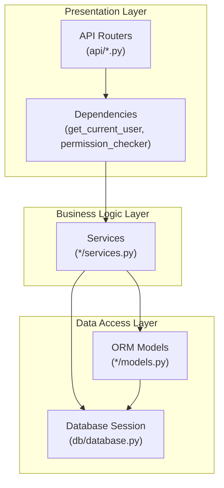
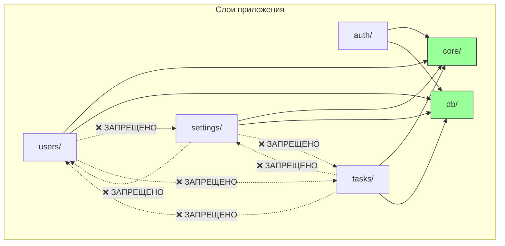

# Архитектура Бэкенда

Бэкенд проекта Infraportal построен на **модульной архитектуре с сервисным слоем**. Это не классическая Clean Architecture, но архитектура обеспечивает чёткое разделение ответственности и масштабируемость.

## Технологический стек

| Технология | Назначение |
|------------|------------|
| **FastAPI** | Веб-фреймворк, REST API |
| **SQLAlchemy 2.0** | ORM (Object-Relational Mapping) |
| **Alembic** | Миграции базы данных |
| **PostgreSQL** | Реляционная база данных |
| **Pydantic** | Валидация данных, схемы API |
| **python-jose** | JWT токены |
| **argon2-cffi** | Хеширование паролей |
| **cryptography** | Шифрование секретов (Fernet) |
| **Celery** | Фоновые задачи |
| **Redis** | Брокер сообщений для Celery |

---

## Структура проекта

```
backend/
├── main.py                    # Точка входа FastAPI
├── alembic/                   # Миграции БД
│   └── versions/
│
└── app/                       # Основной код приложения
    ├── core/                  # Ядро (конфигурация, безопасность)
    │   ├── config.py          # Настройки из .env
    │   ├── security.py        # Хеширование, шифрование, токены
    │   ├── jwt_provider.py    # Создание/проверка JWT
    │   ├── initial_data_loader.py  # Загрузчик начальных данных
    │   └── permissions_registry.py # Autodiscovery разрешений
    │
    ├── db/                    # Слой данных
    │   ├── database.py        # Подключение, сессии
    │   └── orm_base.py        # Base для моделей
    │
    ├── auth/                  # Аутентификация
    │   ├── models.py          # UserSession
    │   ├── schemas.py         # LoginRequest, TokenResponse
    │   ├── services.py        # AuthService
    │   ├── dependencies.py    # get_current_user, permission_checker
    │   └── api/               # Роутеры /auth/*
    │
    ├── users/                 # Модуль пользователей
    │   ├── models.py          # User, Group, Role, Permission
    │   ├── permissions.py     # Объявление разрешений модуля
    │   ├── initial_data.py    # Начальные данные (admin, etc.)
    │   ├── api/               # Роутеры /users, /groups, /roles
    │   ├── local/             # Локальные пользователи
    │   │   ├── services.py    # UserService
    │   │   └── schemas.py     # CreateUserSchema, etc.
    │   ├── ldap/              # LDAP пользователи
    │   │   └── services.py    # LDAP логика
    │   ├── groups/            # Группы
    │   ├── roles/             # Роли
    │   └── permissions/       # PermissionService
    │
    ├── settings/              # Модуль настроек
    │   ├── models.py          # CoreSetting, LdapSetting
    │   ├── api/               # Роутеры /settings/*
    │   ├── core/              # Базовые настройки
    │   └── ldap/              # LDAP настройки
    │
    └── tasks/                 # Фоновые задачи
        ├── models.py          # TaskExecution
        ├── registry.py        # TASK_REGISTRY
        ├── services.py        # TaskService
        └── api/               # Роутеры /tasks
```

---

## Слои архитектуры



### 1. Presentation Layer (API)

**Файлы:** `app/*/api/*.py`

Отвечает за:
- Определение HTTP-эндпоинтов (роутеры FastAPI)
- Валидация входных данных (Pydantic schemas)
- Проверка аутентификации и авторизации
- Формирование HTTP-ответов

```python
# app/users/api/users.py
@router.post("/", response_model=UserResponseSchema)
def create_user(
    data: CreateUserSchema,
    service: UserService = Depends(),
    current_user = Depends(get_current_user),
    _: None = Depends(permission_checker(["users:create"]))
):
    return service.create_user(data)
```

### 2. Business Logic Layer (Services)

**Файлы:** `app/*/services.py`, `app/*/*/services.py`

Отвечает за:
- Бизнес-логику и правила
- Оркестрацию операций
- Вызов других сервисов

```python
# app/users/local/services.py
class UserService:
    def __init__(self, db: db_dependency):
        self.db = db

    def create_user(self, data: CreateUserSchema) -> UserResponseSchema:
        # Бизнес-логика: проверки, хеширование пароля, etc.
        new_user = User(
            login=data.login,
            password=hash_password(data.password),
            ...
        )
        self.db.add(new_user)
        self.db.commit()
        return self.get_user_by_id(new_user.id)
```

### 3. Data Access Layer (Models)

**Файлы:** `app/*/models.py`, `app/db/`

Отвечает за:
- Определение ORM-моделей (SQLAlchemy)
- Связи между таблицами
- Управление сессиями БД

```python
# app/users/models.py
class User(Base):
    __tablename__ = "users"
    id = Column(Integer, primary_key=True)
    login = Column(String, unique=True)
    groups = relationship("Group", secondary=user_group_association)
```

---

## Правила зависимостей

### Диаграмма зависимостей



### Правила импорта

```
┌──────────────────────────────────────────────────────────┐
│                    ПРАВИЛА ИМПОРТА                       │
├──────────────────────────────────────────────────────────┤
│ api/*.py   → services.py      ✅ OK                      │
│ api/*.py   → models.py        ❌ Избегать (через service)│
│ api/*.py   → schemas.py       ✅ OK                      │
├──────────────────────────────────────────────────────────┤
│ services.py → models.py       ✅ OK                      │
│ services.py → db/database.py  ✅ OK                      │
│ services.py → core/*          ✅ OK                      │
│ services.py → auth/*          ✅ OK (auth — системный)   │
├──────────────────────────────────────────────────────────┤
│ models.py   → db/orm_base.py  ✅ OK                      │
│ models.py   → services.py     ❌ ЗАПРЕЩЕНО               │
├──────────────────────────────────────────────────────────┤
│ КРОСС-ДОМЕННЫЕ ИМПОРТЫ        ❌ ЗАПРЕЩЕНО               │
│ users/ → settings/            ❌ ЗАПРЕЩЕНО               │
│ users/ → tasks/               ❌ ЗАПРЕЩЕНО               │
│ settings/ → users/            ❌ ЗАПРЕЩЕНО               │
│ tasks/ → users/               ❌ ЗАПРЕЩЕНО               │
└──────────────────────────────────────────────────────────┘
```

> [!IMPORTANT]
> **Прямые импорты между бизнес-доменами ЗАПРЕЩЕНЫ!**
> 
> Все межмодульные зависимости должны проходить через `core/`.
> Если модулю A нужна функциональность модуля B — вынеси общий код в `core/`.

### Примеры

```python
# ❌ ЗАПРЕЩЕНО — прямой импорт между доменами
# app/tasks/services.py
from app.users.models import User  # Нельзя!
from app.settings.ldap.services import get_ldap_settings  # Нельзя!

# ✅ ПРАВИЛЬНО — импорт через core
# app/core/user_utils.py  (общая функциональность)
def get_user_by_id(db, user_id: int):
    ...

# app/tasks/services.py
from app.core.user_utils import get_user_by_id  # OK!
```

```python
# ✅ Разрешённые импорты
from app.core.config import settings           # core — всегда OK
from app.core.security import hash_password    # core — всегда OK
from app.db.database import db_dependency      # db — всегда OK
from app.auth.dependencies import get_current_user  # auth — системный модуль
```

### Исключения

| Модуль | Особенности |
|--------|-------------|
| `core/` | Может импортироваться откуда угодно |
| `db/` | Может импортироваться откуда угодно |
| `auth/` | Системный модуль, может импортироваться из любого домена (для аутентификации) |

---

## Шаблон модуля

Каждый бизнес-модуль в `app/[domain]/` следует структуре:

```
app/[domain]/
├── __init__.py           # Пустой или экспорты
├── models.py             # ORM модели
├── permissions.py        # Объявление разрешений (module_permissions)
├── initial_data.py       # Начальные данные (опционально)
│
├── api/                  # API Layer
│   ├── __init__.py       # Агрегация роутеров → router, internal_router
│   ├── [resource].py     # Публичные эндпоинты
│   └── internal.py       # Внутренние эндпоинты (для воркеров)
│
└── [subdomain]/          # Подмодуль (опционально)
    ├── services.py       # Бизнес-логика
    └── schemas.py        # Pydantic схемы
```

---

## Auto-Discovery механизмы

### 1. API Routers

`main.py` автоматически сканирует `app/*/api/` и подключает:
- `router` → `/api/v1/{module}`
- `internal_router` → `/api/internal/{module}`

### 2. Initial Data

`initial_data_loader.py` находит все `app/*/initial_data.py` и вызывает `init_data(db)`.

### 3. Permissions

`permissions_registry.py` находит все `app/*/permissions.py` и собирает `module_permissions`.

### 4. Celery Tasks

`registry.py` находит все `app/*/tasks.py` и регистрирует `TASK_DEFINITIONS`.

---

## Dependency Injection

FastAPI DI используется для внедрения зависимостей:

```python
# Сервис автоматически получает db через Depends
class UserService:
    def __init__(self, db: db_dependency):
        self.db = db

# В роутере сервис инжектится автоматически
@router.get("/")
def list_users(service: UserService = Depends()):
    return service.list_users()
```

---

## Безопасность

### Аутентификация
- JWT токены (access + refresh)
- Access token: 15 минут, содержит permissions
- Refresh token: 30 дней, в httpOnly cookie

### Авторизация
- RBAC: User → Groups → Roles → Permissions
- `permission_checker` проверяет права из JWT без запроса к БД

### Шифрование
- Пароли: Argon2 (необратимое хеширование)
- Секреты: Fernet (обратимое шифрование)

---

## Интеграции

### LDAP
- Hybrid authentication flow
- Auto-provisioning пользователей
- Пакетная синхронизация через Celery

### Celery
- Backend отправляет задачи, Worker выполняет
- DatabaseScheduler для периодических задач
- Internal API для получения секретов воркером
