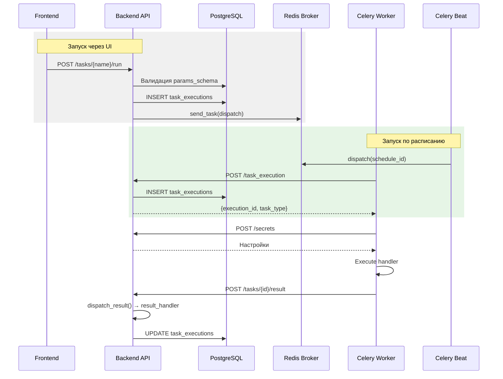

# Архитектура Фоновых Задач (Celery)

Проект использует `Celery` для выполнения асинхронных и периодических задач. Система разделена на три компонента:

1.  **Backend**: Хранит метаданные задач, создаёт `TaskExecution`, обрабатывает результаты.
2.  **Celery Worker**: Выполняет бизнес-логику задач.
3.  **Celery Beat**: Планирует периодические задачи.

## Архитектура взаимодействия



---

## Компоненты Backend

### 1. Контракт задачи

Файл: `backend/app/core/task_contract.py`

```python
@dataclass
class TaskDefinition:
    name: str                    # "users:sync_ldap"
    display_name: str            # "Синхронизация LDAP"
    category: str                # "users"
    permission: str              # "users:update"
    secrets: list[str]           # ["LDAP_URI", "LDAP_BIND_PASSWORD"]
    params_schema: Type[BaseModel] | None  # Pydantic модель
    result_handler: Callable | None        # Обработчик результата
```

### 2. Автообнаружение задач

Файл: `backend/app/core/task_collector.py`

При старте `collect_all_tasks()` сканирует `app/` на наличие:
- `TASK` — одиночный `TaskDefinition`
- `TASK_DEFINITIONS` — список задач

```python
from app.core.task_collector import collect_all_tasks, get_task_definition

# Получить все задачи
tasks = collect_all_tasks()

# Получить задачу по имени
task = get_task_definition("users:sync_ldap")
```

### 3. Синхронизация с БД

Файл: `backend/app/tasks/initial_data.py`

При старте `sync_task_definitions()`:
1. Собирает задачи через `collect_all_tasks()`
2. Для Pydantic схем генерирует JSON Schema (`model_json_schema()`)
3. Upsert в таблицу `task_definitions`

### 4. Обработка результата

Файл: `backend/app/core/task_dispatcher.py`

```python
def dispatch_result(db: Session, task_type: str, result: dict) -> dict:
    """Передаёт результат в result_handler модуля."""
    task_def = get_task_definition(task_type)
    if task_def.result_handler:
        return task_def.result_handler(result, db)
    return {"status": "no_handler", "raw_result": result}
```

---

## Компоненты Worker

Директория: `celery_worker/`

### Структура

```
celery_worker/
├── handlers/              # Обработчики задач
│   ├── users/
│   │   └── sync_ldap.py
│   ├── tasks/
│   │   └── cleanup.py
│   └── test_handler.py
├── task_registry.py       # Реестр обработчиков
├── tasks.py               # dispatch_task()
└── tests/
```

### Процесс выполнения

1. Worker получает задачу из Redis
2. Если plановая (`schedule_id`) → запрос `POST /task_execution`
3. Запрос секретов `POST /secrets`
4. Обновление статуса `PATCH /tasks/{id}` (heartbeat каждые 30 сек)
5. Выполнение handler
6. Отправка результата `POST /tasks/{id}/result`

### Регистрация handler

```python
# celery_worker/handlers/module/my_handler.py
from task_registry import register_task_handler

def my_handler(execution_id: str, secrets: dict, **kwargs):
    """Выполняет задачу."""
    result = do_work(secrets)
    return {"data": result}

register_task_handler("module:my_task", my_handler)
```

---

## Модели данных

### TaskDefinitionModel

Файл: `backend/app/tasks/models.py`

```python
class TaskDefinitionModel(Base):
    __tablename__ = "task_definitions"
    
    name = Column(String, primary_key=True)
    display_name = Column(String, nullable=False)
    category = Column(String, nullable=False)
    permission = Column(String, nullable=True)
    params_schema = Column(JSON, nullable=True)   # JSON Schema
    secrets = Column(ARRAY(String), default=[])
```

### TaskExecution

```python
class TaskExecution(Base):
    __tablename__ = "task_executions"
    
    id = Column(UUID, primary_key=True)
    task_type = Column(String, index=True)
    status = Column(Enum(ExecutionStatus))
    params = Column(JSON)
    result = Column(JSON)
    triggered_by = Column(String)
    created_at = Column(DateTime)
    started_at = Column(DateTime)
    finished_at = Column(DateTime)
    heartbeat_at = Column(DateTime)
```

### ExecutionStatus

```python
class ExecutionStatus(str, Enum):
    PENDING = "PENDING"
    IN_PROGRESS = "IN_PROGRESS"
    SUCCESS = "SUCCESS"
    FAILURE = "FAILURE"
    RETRY = "RETRY"
    REVOKED = "REVOKED"
```

---

## Celery Beat (Scheduler)

Директория: `celery_beat/`

Использует `DatabaseScheduler` (`celery-sqlalchemy-scheduler`) для хранения расписания в PostgreSQL.

### Инициализация периодических задач

Файл: `backend/app/tasks/initial_data.py`

При первом запуске создаются:

1. **System: Cleanup Zombie Tasks** — каждые 5 минут
2. **Users: LDAP Sync** — по расписанию из `LDAP_SYNC_SCHEDULE`

---

## Создание новой задачи

Подробная инструкция: [docs/backend/tasks.md](tasks.md)

### Краткий чеклист

1. **Backend**: Создать `app/{module}/tasks/{name}.py`
   - Определить `TASK = TaskDefinition(...)`
   - Реализовать `result_handler(result, db)`
   
2. **Экспорт**: В `tasks/__init__.py` добавить `TASK_DEFINITIONS = [...]`

3. **Worker**: Создать `handlers/{module}/{name}.py`
   - Реализовать handler
   - Зарегистрировать через `register_task_handler()`

4. **Миграция**: При добавлении новых настроек в `secrets`

---

## Тестирование

### Backend
```bash
cd backend
.venv/bin/pytest tests/test_tasks*.py
```

### Worker
```bash
cd celery_worker
uv run pytest
```

---

## Изменения после рефакторинга

| Было | Стало |
|------|-------|
| `TASK_REGISTRY` dict + tuples | `TaskDefinition` dataclass |
| `registry.py` с `autodiscover_tasks` | `task_collector.py` |
| Hardcoded secrets в internal API | Динамическое чтение из `task_definitions.secrets` |
| Worker напрямую обновлял БД | Worker → result → Backend → `result_handler` |
| Pydantic → JSON Schema вручную | `model_json_schema()` автоматически |
