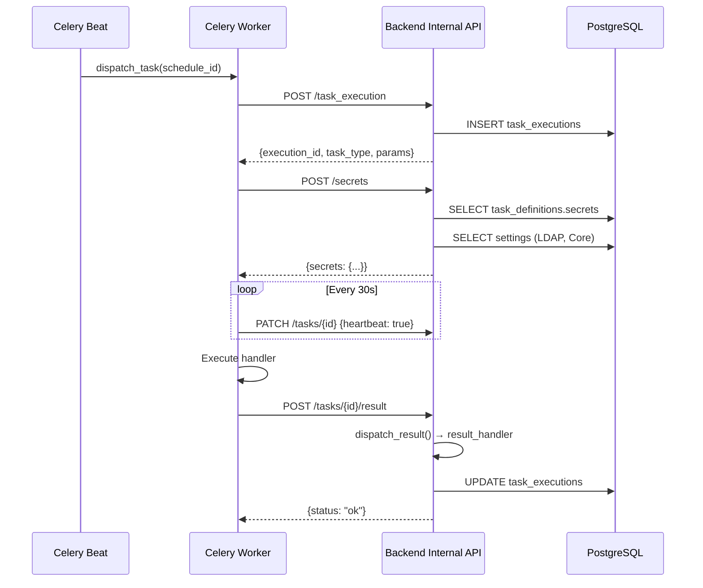

# Внутренний API (Internal API)

Внутренний API используется **исключительно** фоновыми воркерами (Celery Worker) для общения с бэкендом.
Эти эндпоинты не предназначены для вызова фронтендом или внешними пользователями.

## Безопасность

*   **Префикс**: `/api/internal`
*   **Защита**: Все запросы должны содержать заголовок `X-API-Key`.
*   **Ключ**: Значение ключа задается в переменной окружения `CELERY_WORKER_API_KEY` как на бэкенде, так и на воркере.

---

## Ресурсы

### 1. Получение секретов

**POST** `/api/internal/secrets`

Возвращает настройки (секреты), необходимые для выполнения задачи. Список секретов определяется в поле `secrets` контракта `TaskDefinition`.

**Request:**
```json
{
  "task_type": "users:sync_ldap"
}
```

**Response:**
```json
{
  "secrets": {
    "LDAP_URI": "ldaps://ad.example.com:636",
    "LDAP_BIND_DN": "cn=service,dc=example,dc=com",
    "LDAP_BIND_PASSWORD": "decrypted_password",
    "LDAP_BASE_DN": "dc=example,dc=com",
    "LDAP_USER_FILTER": "(objectClass=user)",
    "LDAP_TLS_VERIFY": true
  }
}
```

**Логика:**
1. Читает `task_definitions.secrets` из БД
2. Для каждого ключа вызывает `resolve_setting(db, key)`
3. Резолвер проходит по зарегистрированным геттерам (LDAP → Core)
4. Чувствительные данные дешифруются через Fernet

---

### 2. Создание execution для плановой задачи

**POST** `/api/internal/task_execution`

Создаёт запись `TaskExecution` для задачи, запущенной по расписанию (Celery Beat).
Возвращает `execution_id`, который Worker использует для отчётности.

**Request:**
```json
{
  "schedule_id": "Users: LDAP Sync"
}
```

**Response:**
```json
{
  "execution_id": "550e8400-e29b-41d4-a716-446655440000",
  "task_type": "users:sync_ldap",
  "params": {}
}
```

---

### 3. Отправка результата задачи

**POST** `/api/internal/tasks/{execution_id}/result`

Worker вызывает этот эндпоинт после завершения задачи. Backend:
1. Находит `result_handler` из `TaskDefinition`
2. Передаёт результат в handler для бизнес-обработки
3. Обновляет статус `TaskExecution`

**Request:**
```json
{
  "status": "SUCCESS",
  "result": {
    "users": [
      {"sAMAccountName": "user1", "mail": "user1@example.com"},
      {"sAMAccountName": "user2", "mail": "user2@example.com"}
    ]
  }
}
```

**Response:**
```json
{
  "status": "ok"
}
```

**Важно:** Если `result_handler` выбрасывает исключение, статус задачи меняется на `FAILURE`, а в результат записывается ошибка.

---

### 4. Обновление статуса / Heartbeat

**PATCH** `/api/internal/tasks/{execution_id}`

Используется для:
- Обновления статуса задачи (`IN_PROGRESS`, `SUCCESS`, `FAILURE`)
- Отправки heartbeat (сигнал "жизни")
- Записи промежуточного результата

**Body (обновление статуса):**
```json
{
  "status": "IN_PROGRESS"
}
```

**Body (heartbeat):**
```json
{
  "heartbeat": true
}
```

**Body (результат с ошибкой):**
```json
{
  "status": "FAILURE",
  "result": {
    "error": "Connection timeout to LDAP server"
  }
}
```

---

### 5. Получение зависших задач

**GET** `/api/internal/tasks/stale?timeout_seconds=300`

Возвращает список ID задач, которые не отправляли heartbeat дольше указанного таймаута.
Используется задачей `system:cleanup_zombie_tasks`.

**Query Parameters:**
- `timeout_seconds` (int, default: 300) — таймаут в секундах

**Response:**
```json
[
  "550e8400-e29b-41d4-a716-446655440000",
  "6ba7b810-9dad-11d1-80b4-00c04fd430c8"
]
```

---

## Диаграмма взаимодействия



---

## Изменения после рефакторинга

| До | После |
|----|-------|
| Hardcoded if-elif в `/secrets` | Динамическое чтение из `task_definitions.secrets` |
| Worker напрямую обновлял статус | Worker отправляет результат → Backend вызывает `result_handler` |
| Логика синхронизации в Worker | Логика в `result_handler` на Backend |
| POST `/users/sync_ldap` | Не используется, удалён |
