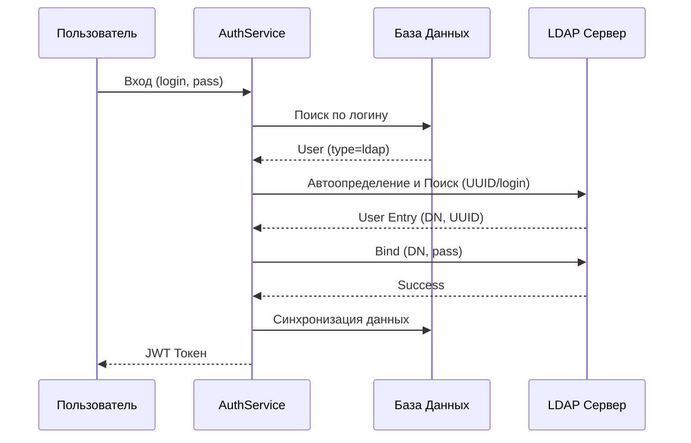

# LDAP Аутентификация

Модуль LDAP обеспечивает интеграцию с внешними каталогами (Active Directory, OpenLDAP) для аутентификации пользователей и автоматического управления учетными записями.

## Конфигурация

Все параметры настраиваются динамически в разделе **Настройки -> LDAP**. 
Подробное описание параметров см. в [Документации по настройкам LDAP](settings_ldap.md).

> [!IMPORTANT]
> Пароль `LDAP_BIND_PASSWORD` хранится в базе данных в зашифрованном виде с использованием алгоритма Fernet. Ключ шифрования генерируется на основе `SECRET_KEY` приложения.

## Алгоритм аутентификации (Hybrid Flow)

Приложение использует гибридную схему, где локальные и LDAP-пользователи сосуществуют:

1.  **Локальный поиск:** Система ищет пользователя в базе данных по логину.
2.  **Тип пользователя:**
    *   Если пользователь имеет тип `built_in` или `local`, пароль проверяется локально.
    *   Если пользователь имеет тип `ldap` (или не найден вовсе), система проверяет, включена ли интеграция (`LDAP_ENABLED`).
3.  **LDAP Search and Bind:**
    *   Если LDAP включен, выполняется попытка поиска пользователя в каталоге.
    *   Используется стабильный идентификатор (UUID) для сопоставления: `objectGUID` для Active Directory и `entryUUID` для OpenLDAP.
    *   Если пользователь найден, выполняется попытка `Bind` (проверка пароля) под его DN.
4.  **Auto-provisioning (Авто-создание):**
    *   Если LDAP-пароль верен, но пользователя нет в локальной БД, он создается автоматически с типом `ldap`.
5.  **Data Synchronization:**
    *   При каждом успешном входе обновляются `login`, `name` и `ldap_dn` пользователя в локальной БД на основе актуальных данных из LDAP. Это позволяет прозрачно обрабатывать смену фамилии или перемещение пользователя между Org Units.

## Особенности реализации

### Автоопределение типа сервера
Система автоматически определяет тип сервера при подключении, запрашивая `Root DSE` и проверяя поддержку OID `1.2.840.113556.1.4.800` (признак Active Directory). На основе этого выбираются соответствующие атрибуты поиска:
- **AD:** `sAMAccountName`, `objectGUID`.
- **OpenLDAP:** `uid`, `entryUUID`.

### Безопасность
- Поддержка **TLS** для защиты трафика между приложением и LDAP-сервером. Используется автоматически, если `LDAP_URI` начинается с `ldaps://`. Проверка сертификатов включена по умолчанию, но может быть отключена через `LDAP_TLS_VERIFY`.
- Использование метода **Search and Bind** исключает хранение паролей LDAP-пользователей в локальной базе данных.
- Поддержка дополнительного `LDAP_USER_FILTER` для гибкой настройки доступа (например, проверка членства в группах).

## Схема взаимодействия

## Пакетная Синхронизация (Batch Sync)

Помимо синхронизации при входе (JIT), поддерживается фоновая синхронизация всех пользователей через Celery.

- **Задача**: `users:sync_ldap`.
- **Механизм**:
    1. Celery Worker (через `celery_worker`) получает настройки подключения от бэкенда.
    2. Скачивает всех пользователей из LDAP, соответствующих фильтру.
    3. Отправляет пакет данных на внутренний API бэкенда (`/api/internal/users/sync_ldap`).
    4. Бэкенд обновляет существующих пользователей и деактивирует тех, кто пропал из LDAP (опционально, в зависимости от логики).
- **Расписание**: Настраивается через `LDAP_SYNC_SCHEDULE` (Cron-формат) в [настройках](settings_ldap.md).
