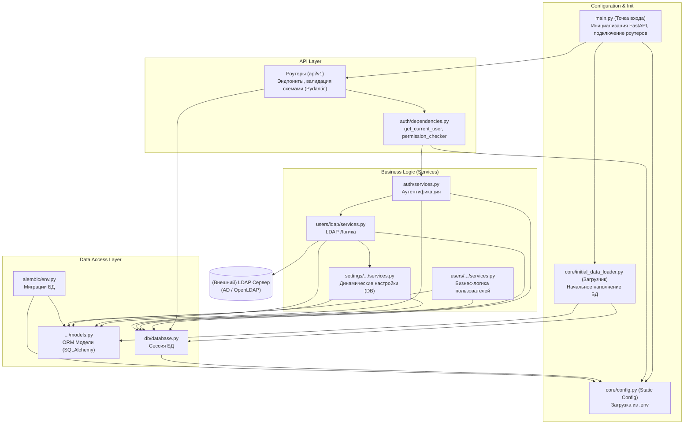

# Обзор Бэкенда

Бэкенд проекта Infraportal разработан на Python с использованием фреймворка FastAPI. Он предоставляет RESTful API для взаимодействия с фронтендом и управляет всей бизнес-логикой, доступом к данным, безопасностью и системными настройками.

## Ключевые Технологии

*   **FastAPI**: Современный, быстрый (высокопроизводительный) веб-фреймворк для создания API на Python.
*   **SQLAlchemy**: Мощный инструментарий SQL ORM (Object Relational Mapper) для взаимодействия с базой данных.
*   **Alembic**: Инструмент для миграции баз данных, используемый для управления изменениями схемы базы данных.
*   **JWT (JSON Web Tokens)**: Используются для аутентификации пользователей.
*   **LDAP/Active Directory**: Интеграция с внешними каталогами для корпоративной аутентификации.
-   **PostgreSQL**: Реляционная база данных для хранения данных приложения.

## Структура Бэкенда

Основная структура проекта находится в директории `backend/app/` и включает следующие ключевые модули:

*   **auth**: Аутентификация и управление токенами (включая гибридную LDAP Auth).
*   **users**: Управление пользователями, ролями и группами (включая модуль `users/ldap`).
*   **settings**: Модуль управления динамическими настройками системы (хранятся в БД).
*   **api**: Определение маршрутов (routers) API.
*   **core**: Базовая конфигурация и утилиты.
*   **db**: Подключение к базе данных и модели.

## Настройка окружения для разработки

В проекте используется `uv` в качестве менеджера пакетов и виртуальных окружений. Это современный и очень быстрый инструмент, написанный на Rust.

### 1. Установка `uv`

Если у вас еще не установлен `uv`, выполните следующую команду в терминале:
```bash
curl -LsSf https://astral.sh/uv/install.sh | sh
```

### 2. Создание и активация виртуального окружения

Находясь в директории `backend/`, создайте виртуальное окружение:
```bash
# Создаст .venv в текущей директории
uv venv
```

Активируйте созданное окружение:
```bash
# Для Linux и macOS
source .venv/bin/activate
```

### 3. Установка зависимостей

После активации окружения установите все зависимости, указанные в `pyproject.toml`:
```bash
# Синхронизирует ваше окружение с зависимостями из pyproject.toml
# Используйте `uv pip sync` вместо устаревшего `uv sync`
uv pip sync
```

### 4. Управление зависимостями

-   **Добавление новой зависимости**:
    ```bash
    # Пример установки новой библиотеки. uv автоматически добавит ее в pyproject.toml
    uv add "some-new-package==1.2.3"
    ```

-   **Обновление зависимостей**:
    После ручного изменения `pyproject.toml` повторно выполните `uv pip sync`, чтобы привести окружение в соответствие.

## Архитектурная схема

Ниже представлена высокоуровневая схема архитектуры бэкенда, показывающая основные компоненты и их зависимости.



## Автоматическая регистрация маршрутов (Auto-Discovery)

В `backend/main.py` реализован механизм авто-обнаружения API роутеров. При запуске приложения система сканирует все подмодули в директории `app/` (например, `users`, `tasks`) и пытается импортировать из них файл `api`.

*   **Public API**: Если в модуле `api` найден объект `router`, он подключается с префиксом `/api/v1`.
*   **Internal API**: Если найден объект `internal_router`, он подключается с префиксом `/api/internal`.

Это позволяет добавлять новые модули без необходимости ручного редактирования `main.py`.

---

## Разделы Документации Бэкенда

Ниже представлены ссылки на детальную документацию по различным аспектам бэкенда:

*   [Архитектура](architecture.md) — детальное описание архитектуры и слоёв
*   [Руководство разработчика](developer-guide.md) — правила разработки и стиль кода
*   [API и Маршрутизация](api.md)
*   [Аутентификация и Авторизация](auth.md)
*   [Ядро Приложения (Core)](core.md)
*   [База Данных и Модели](db.md)
*   [Управление Пользователями](users.md)
*   [Управление Настройками](settings_overview.md)
*   [LDAP Аутентификация](ldap_auth.md)
*   [Фоновые задачи (Celery)](celery.md)
*   [Тестирование Бэкенда](testing.md)

