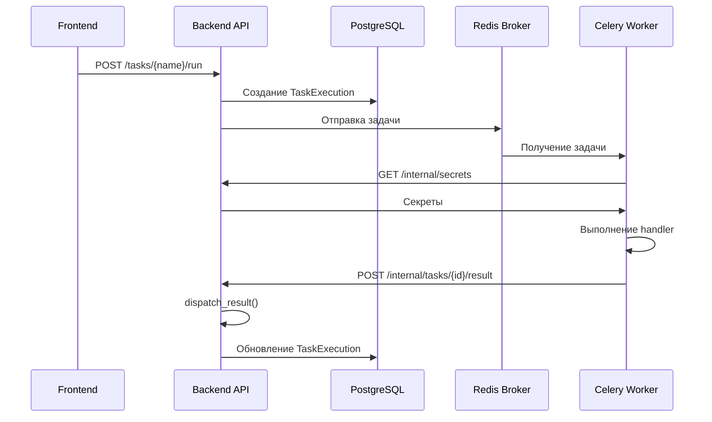

# Архитектура Фоновых Задач

Этот документ описывает архитектуру системы фоновых задач в Infraportal, включая определение задач, их выполнение и обработку результатов.

## 1. Обзор

Система задач построена на следующих принципах:

- **Единое место определения**: Задачи определяются в Backend через контракт `TaskDefinition`
- **Автообнаружение**: Система автоматически находит все задачи при запуске
- **Декларативные секреты**: Каждая задача указывает, какие настройки ей нужны
- **Обработка результатов**: Результат от Worker передаётся в `result_handler` модуля



---

## 2. Контракт TaskDefinition

Файл: `backend/app/core/task_contract.py`

Каждая задача описывается dataclass'ом `TaskDefinition`:

```python
@dataclass
class TaskDefinition:
    name: str                              # Уникальное имя: "module:action"
    display_name: str                      # Человекочитаемое имя
    category: str                          # Категория для группировки
    permission: str                        # Требуемое разрешение
    secrets: list[str] = []                # Список ключей настроек
    params_schema: Type[BaseModel] | None  # Pydantic модель параметров
    result_handler: Callable | None        # Обработчик результата
```

### Поля

| Поле | Тип | Описание |
|------|-----|----------|
| `name` | `str` | Уникальный идентификатор в формате `category:action` (напр. `users:sync_ldap`) |
| `display_name` | `str` | Название для отображения в UI |
| `category` | `str` | Категория для группировки задач |
| `permission` | `str` | Разрешение, требуемое для запуска |
| `secrets` | `list[str]` | Ключи настроек, которые будут переданы Worker'у |
| `params_schema` | `Type[BaseModel] \| None` | Pydantic модель для валидации параметров запуска |
| `result_handler` | `Callable[[dict, Session], dict] \| None` | Функция обработки результата от Worker'а |

---

## 3. Модели данных

Файл: `backend/app/tasks/models.py`

### TaskDefinitionModel

Хранит метаданные задач в БД для доступа через API:

```python
class TaskDefinitionModel(Base):
    __tablename__ = "task_definitions"
    
    name = Column(String, primary_key=True)
    display_name = Column(String, nullable=False)
    category = Column(String, nullable=False)
    permission = Column(String, nullable=True)
    params_schema = Column(JSON, nullable=True)  # JSON Schema
    secrets = Column(ARRAY(String), default=[])
```

### TaskExecution

История выполнений задач:

```python
class TaskExecution(Base):
    __tablename__ = "task_executions"
    
    id = Column(UUID, primary_key=True)
    task_type = Column(String, nullable=False)
    status = Column(Enum(ExecutionStatus))
    params = Column(JSON)
    result = Column(JSON)
    triggered_by = Column(String)
    created_at = Column(DateTime)
    started_at = Column(DateTime)
    finished_at = Column(DateTime)
    heartbeat_at = Column(DateTime)
```

### ExecutionStatus

```python
class ExecutionStatus(str, enum.Enum):
    PENDING = "PENDING"
    IN_PROGRESS = "IN_PROGRESS"
    SUCCESS = "SUCCESS"
    FAILURE = "FAILURE"
    RETRY = "RETRY"
    REVOKED = "REVOKED"
```

---

## 4. Жизненный цикл задачи

### 4.1 Определение

Задачи определяются в подмодулях `tasks/`:

```
backend/app/
├── users/ldap/tasks/
│   ├── __init__.py       # TASK_DEFINITIONS = [sync_ldap]
│   └── sync_ldap.py      # TASK = TaskDefinition(...)
└── tasks/tasks/
    ├── __init__.py
    └── cleanup_zombie.py
```

### 4.2 Сбор задач

Файл: `backend/app/core/task_collector.py`

При старте приложения `collect_all_tasks()` сканирует все модули:

```python
def collect_all_tasks() -> list[TaskDefinition]:
    """Собирает все TaskDefinition из пакета app."""
    # Ищет TASK и TASK_DEFINITIONS во всех модулях с "tasks" в пути
```

### 4.3 Синхронизация с БД

Файл: `backend/app/tasks/initial_data.py`

При старте `sync_task_definitions()` синхронизирует код с БД:
- Обновляет существующие записи
- Добавляет новые задачи
- JSON Schema генерируется из Pydantic: `model.model_json_schema()`

### 4.4 Запуск

1. **UI/API** вызывает `POST /api/v1/tasks/{name}/run`
2. **TaskService** валидирует параметры через `params_schema`
3. Создаётся `TaskExecution` со статусом `PENDING`
4. Задача отправляется в Celery через Redis

### 4.5 Выполнение

1. **Worker** получает задачу из Redis
2. Запрашивает секреты: `POST /api/internal/secrets`
3. Выполняет handler
4. Отправляет результат: `POST /api/internal/tasks/{id}/result`

### 4.6 Обработка результата

Файл: `backend/app/core/task_dispatcher.py`

```python
def dispatch_result(db: Session, task_type: str, result: dict) -> dict:
    """Передаёт результат в result_handler модуля."""
    task_def = get_task_definition(task_type)
    if task_def.result_handler:
        return task_def.result_handler(result, db)
```

---

## 5. Создание новой задачи

### Шаг 1: Создать структуру файлов

```bash
mkdir -p backend/app/{module}/tasks
touch backend/app/{module}/tasks/__init__.py
touch backend/app/{module}/tasks/{task_name}.py
```

### Шаг 2: Определить задачу

```python
# backend/app/{module}/tasks/{task_name}.py
from sqlalchemy.orm import Session
from pydantic import BaseModel, Field
from app.core.task_contract import TaskDefinition

# Опционально: схема параметров
class MyTaskParams(BaseModel):
    """Параметры задачи."""
    param1: str = Field(..., description="Описание параметра")
    param2: int = Field(default=10, ge=1)

def result_handler(result: dict, db: Session) -> dict:
    """
    Обрабатывает результат от Worker'а.
    
    Args:
        result: Данные от Worker'а
        db: SQLAlchemy сессия
    
    Returns:
        Обработанный результат для сохранения в execution.result
    """
    # Бизнес-логика обработки результата
    processed_count = result.get("count", 0)
    return {"summary": f"Обработано {processed_count} записей"}

TASK = TaskDefinition(
    name="module:my_task",
    display_name="Моя задача",
    category="module",
    permission="module:execute",
    secrets=["API_KEY", "API_SECRET"],  # Будут переданы Worker'у
    params_schema=MyTaskParams,          # Или None
    result_handler=result_handler,       # Или None
)
```

### Шаг 3: Экспортировать в __init__.py

```python
# backend/app/{module}/tasks/__init__.py
from .{task_name} import TASK as my_task

TASK_DEFINITIONS = [my_task]
```

### Шаг 4: Добавить разрешение

```python
# backend/app/{module}/permissions.py
module_permissions = [
    # ...
    {'name': 'module:execute', 'description': 'Execute module tasks'},
]
```

### Шаг 5: Создать handler в Worker

```python
# celery_worker/handlers/{module}/{task_name}.py
from task_registry import register_task_handler

def my_task_handler(execution_id: str, secrets: dict, **kwargs):
    """
    Выполняет задачу.
    
    Args:
        execution_id: ID выполнения
        secrets: Секреты из Backend
        **kwargs: Параметры задачи
    
    Returns:
        Результат для передачи в result_handler
    """
    api_key = secrets.get("API_KEY")
    param1 = kwargs.get("param1")
    
    # Выполнение работы...
    
    return {"count": 42, "data": [...]}

register_task_handler("module:my_task", my_task_handler)
```

---

## 6. Internal API Reference

Все эндпоинты защищены заголовком `X-API-Key`.

### POST /api/internal/secrets

Возвращает секреты для задачи.

**Request:**
```json
{"task_type": "users:sync_ldap"}
```

**Response:**
```json
{
  "secrets": {
    "LDAP_URI": "ldaps://...",
    "LDAP_BIND_PASSWORD": "..."
  }
}
```

---

### POST /api/internal/task_execution

Создаёт execution для задачи по расписанию.

**Request:**
```json
{"schedule_id": "Users: LDAP Sync"}
```

**Response:**
```json
{
  "execution_id": "uuid",
  "task_type": "users:sync_ldap",
  "params": {}
}
```

---

### POST /api/internal/tasks/{execution_id}/result

Принимает результат от Worker и вызывает `result_handler`.

**Request:**
```json
{
  "status": "SUCCESS",
  "result": {"users": [...]}
}
```

**Response:**
```json
{"status": "ok"}
```

---

### PATCH /api/internal/tasks/{execution_id}

Обновляет статус задачи или отправляет heartbeat.

**Body:**
```json
{
  "status": "IN_PROGRESS",
  "heartbeat": true
}
```

---

### GET /api/internal/tasks/stale

Возвращает ID задач без heartbeat дольше `timeout_seconds`.

**Query:** `?timeout_seconds=300`

**Response:**
```json
["uuid1", "uuid2"]
```

---

## 7. Существующие задачи

### users:sync_ldap

**Файл:** `backend/app/users/ldap/tasks/sync_ldap.py`

Синхронизация пользователей из LDAP.

| Поле | Значение |
|------|----------|
| Permission | `users:update` |
| Secrets | `LDAP_URI`, `LDAP_BIND_DN`, `LDAP_BIND_PASSWORD`, `LDAP_BASE_DN`, `LDAP_USER_FILTER`, `LDAP_TLS_VERIFY` |
| Params | нет |

---

### system:cleanup_zombie_tasks

**Файл:** `backend/app/tasks/tasks/cleanup_zombie.py`

Очистка зависших задач.

| Поле | Значение |
|------|----------|
| Permission | `tasks:cleanup` |
| Secrets | нет |
| Params | `timeout_seconds: int = 300` |

---

## 8. Best Practices

1. **Именование**: `category:action` (напр. `users:sync_ldap`, `reports:generate`)

2. **Secrets**: Указывайте только необходимые ключи в `secrets`

3. **Result Handler**: Всегда обрабатывайте результат на Backend для:
   - Сохранения данных в БД
   - Формирования читаемого `result` для UI

4. **Параметры**: Используйте Pydantic для валидации с описаниями полей

5. **Разрешения**: Создавайте отдельное разрешение для каждой задачи

6. **Heartbeat**: Worker отправляет heartbeat каждые 30 секунд для обнаружения зависших задач
