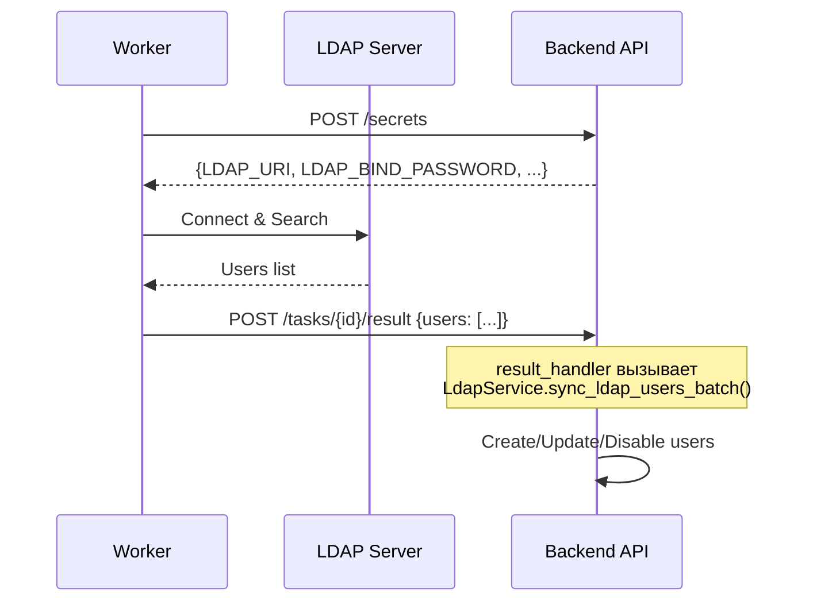
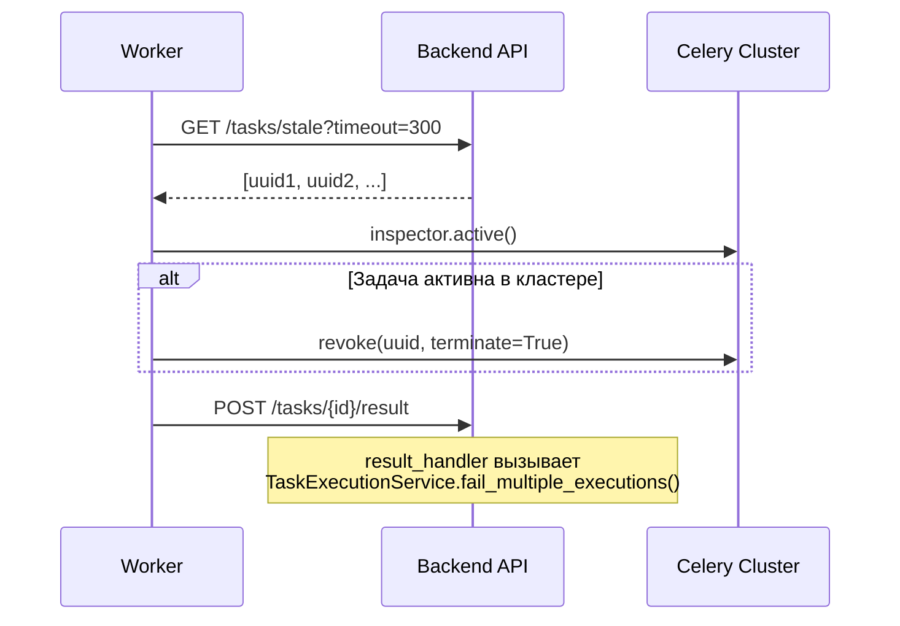

# Каталог Обработчиков (Worker Handlers)

В данном разделе описаны все доступные обработчики задач (Handlers), реализованные в `celery_worker`.

## Архитектура

После рефакторинга обработчики работают по новой схеме:

```
Worker Handler → возвращает результат → POST /tasks/{id}/result → dispatch_result() → result_handler
```

Бизнес-логика обработки результата (сохранение в БД, статистика) выполняется на **Backend** в `result_handler`.

---

## 1. Пользователи (Users)

### `users:sync_ldap`

| Поле | Значение |
|------|----------|
| **Файл (Worker)** | `handlers/users/sync_ldap.py` |
| **Файл (Backend)** | `app/users/ldap/tasks/sync_ldap.py` |
| **Permission** | `users:update` |
| **Расписание** | Настраивается через `LDAP_SYNC_SCHEDULE` |

**Описание**: Выполняет пакетную синхронизацию пользователей с LDAP сервером.

**Секреты**:
- `LDAP_URI` — URI сервера (ldaps://...)
- `LDAP_BIND_DN` — DN для подключения
- `LDAP_BIND_PASSWORD` — пароль (дешифруется)
- `LDAP_BASE_DN` — Base DN для поиска
- `LDAP_USER_FILTER` — LDAP фильтр
- `LDAP_TLS_VERIFY` — проверка сертификата

**Workflow**:



**result_handler** (на Backend):
- Вызывает `LdapService.sync_ldap_users_batch(db, users_data)`
- Создаёт новых пользователей
- Обновляет существующих
- Деактивирует отсутствующих

---

## 2. Системные (System)

### `system:cleanup_zombie_tasks`

| Поле | Значение |
|------|----------|
| **Файл (Worker)** | `handlers/tasks/cleanup.py` |
| **Файл (Backend)** | `app/tasks/tasks/cleanup_zombie.py` |
| **Permission** | `tasks:cleanup` |
| **Расписание** | Каждые 5 минут (IntervalSchedule) |

**Описание**: Служебная задача для очистки "зависших" (Zombie) задач.

**Параметры** (Pydantic):
```python
class CleanupZombieParams(BaseModel):
    timeout_seconds: int = Field(
        default=300,
        ge=60,
        description="Таймаут heartbeat в секундах"
    )
```

**Workflow**:



**result_handler** (на Backend):
- Получает список `terminated_ids`
- Вызывает `TaskExecutionService.fail_multiple_executions()`
- Помечает задачи как `FAILURE` с причиной

---

## 3. Тестовые (Debug)

### `test_task`

| Поле | Значение |
|------|----------|
| **Файл** | `handlers/test_handler.py` |
| **Permission** | — |

**Описание**: Простая задача для проверки работоспособности очереди.

- Принимает любые параметры
- Возвращает их обратно со статусом `success`
- Используется для smoke-тестирования

---

## Создание нового handler

1. Создать файл `celery_worker/handlers/{module}/{name}.py`

2. Реализовать функцию:

```python
from task_registry import register_task_handler

def my_handler(execution_id: str, secrets: dict, **kwargs):
    """
    Выполняет задачу.
    
    Args:
        execution_id: ID выполнения (для логов)
        secrets: Настройки из Backend
        **kwargs: Параметры задачи
    
    Returns:
        dict: Результат для передачи в result_handler
    """
    api_key = secrets.get("API_KEY")
    param1 = kwargs.get("param1")
    
    # Бизнес-логика...
    
    return {
        "processed": 42,
        "data": [...]
    }

register_task_handler("module:my_task", my_handler)
```

3. Handler автоматически обнаружится при запуске Worker

4. Результат будет отправлен на `POST /tasks/{id}/result` инфраструктурой Worker

---

## Важно

- **Секреты** получаются автоматически из таблицы `task_definitions.secrets`
- **Heartbeat** отправляется каждые 30 секунд для обнаружения зависших задач
- **Result handler** на Backend обрабатывает результат (сохранение в БД, статистика)
- **Ошибки** — если handler выбросит исключение, задача будет помечена как `FAILURE`
