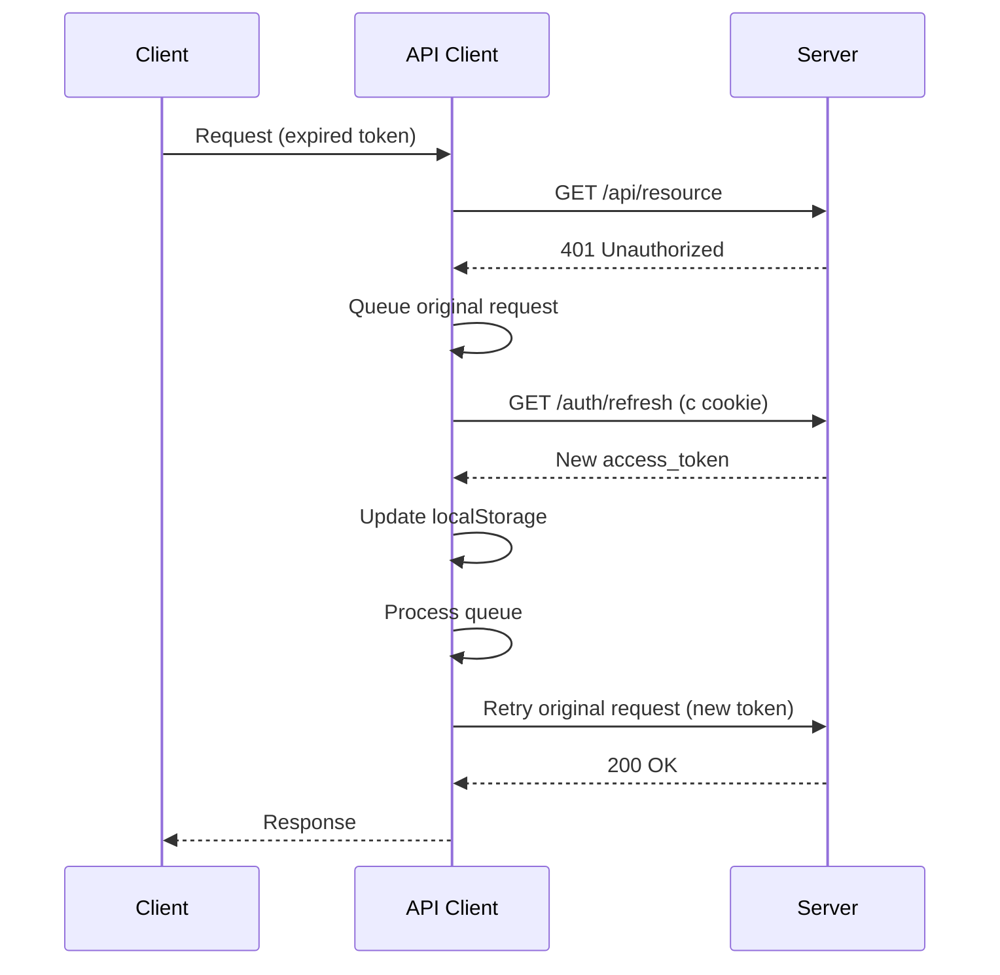

# API Layer

Детальная документация API-слоя фронтенда.

## Содержание

1. [API Client](#api-client)
2. [Перехватчики](#перехватчики)
3. [API Модули](#api-модули)
4. [DTO и Pydantic](#dto-и-pydantic)
5. [TanStack Query](#tanstack-query)
6. [Обработка ошибок](#обработка-ошибок)

---

## API Client

Централизованный HTTP-клиент на базе Axios.

### Расположение

```
src/shared/api/
├── api-client.ts    # Axios instance с interceptors
└── types.ts         # AuthTokens, ApiError, ExtendedRequestConfig
```

### Конфигурация

```typescript
// src/shared/api/api-client.ts
const apiClient = axios.create({
    baseURL: import.meta.env.VITE_API_URL,
    timeout: 5000,
    headers: {
        'Content-Type': 'application/json',
        Accept: 'application/json',
    },
    withCredentials: true,  // Для cookies (refresh token)
});
```

### Использование

```typescript
import { apiClient } from '@shared/api/api-client';

// GET
const { data } = await apiClient.get<User[]>('/users');

// POST
const { data } = await apiClient.post<User>('/users', userData);

// PUT
const { data } = await apiClient.put<User>(`/users/${id}`, userData);

// DELETE
await apiClient.delete(`/users/${id}`);
```

---

## Перехватчики

### Request Interceptor

Автоматически добавляет `Authorization` header:

```typescript
apiClient.interceptors.request.use((config) => {
    const accessToken = localStorage.getItem('Token');
    if (accessToken) {
        config.headers.Authorization = `Bearer ${accessToken}`;
    }
    return config;
});
```

### Response Interceptor — Auto-Refresh Token

При получении `401 Unauthorized`:



### Логика очереди

```typescript
let isRefreshing = false;
let failedQueue: QueueItem[] = [];

// При 401:
if (isRefreshing) {
    // Добавить в очередь, ждать refresh
    return new Promise((resolve, reject) => {
        failedQueue.push({ resolve, reject });
    }).then((token) => {
        originalRequest.headers.Authorization = `Bearer ${token}`;
        return apiClient(originalRequest);
    });
}

// Первый 401 — начать refresh
isRefreshing = true;
const { data } = await axios.get('/auth/refresh', { withCredentials: true });
localStorage.setItem('Token', data.access_token);
processQueue(null, data.access_token);  // Продолжить очередь
```

### Редирект на Login

При неудачном refresh — очистка токена и редирект:

```typescript
localStorage.removeItem('Token');
if (window.location.pathname !== '/login') {
    window.location.href = '/login';
}
```

---

## API Модули

Каждый бизнес-модуль имеет свой API-слой.

### Структура

```
src/modules/[domain]/api/
├── [domain].api.ts     # Методы API
└── [domain].dto.ts     # Типы (DTO)
```

### Список модулей

| Модуль | Файлы | Endpoints |
|--------|-------|-----------|
| **auth** | `auth.api.ts` | `/auth/login`, `/auth/logout`, `/auth/refresh`, `/auth/me` |
| **users** | `users.api.ts`, `roles.api.ts`, `groups.api.ts` | `/users`, `/roles`, `/groups`, `/permissions` |
| **settings** | `settings.api.ts` | `/settings/core`, `/settings/ldap` |

### Пример: users.api.ts

```typescript
// src/modules/users/api/users.api.ts
import { apiClient } from '@shared/api/api-client';
import { API_ENDPOINTS } from '@shared/constants/apiEndpoints';
import type { User, CreateUserRequest, UpdateUserRequest, PaginatedResponse } from './users.dto';

export const usersApi = {
    list: async (params?: PaginationParams): Promise<PaginatedResponse<User>> => {
        const { data } = await apiClient.get(API_ENDPOINTS.USER_MANAGEMENT.USERS, { params });
        return data;
    },

    get: async (id: number): Promise<User> => {
        const { data } = await apiClient.get(`${API_ENDPOINTS.USER_MANAGEMENT.USERS}/${id}`);
        return data;
    },

    create: async (userData: CreateUserRequest): Promise<User> => {
        const { data } = await apiClient.post(API_ENDPOINTS.USER_MANAGEMENT.USERS, userData);
        return data;
    },

    update: async (id: number, userData: UpdateUserRequest): Promise<User> => {
        // Трансформация: groups → group_ids
        const payload = { ...userData };
        if (payload.groups) {
            (payload as Record<string, unknown>).group_ids = payload.groups;
            delete payload.groups;
        }
        const { data } = await apiClient.put(
            `${API_ENDPOINTS.USER_MANAGEMENT.USERS}/${id}`,
            payload
        );
        return data;
    },

    delete: async (id: number): Promise<void> => {
        await apiClient.delete(`${API_ENDPOINTS.USER_MANAGEMENT.USERS}/${id}`);
    },
};
```

---

## DTO и Pydantic

DTO (Data Transfer Objects) зеркалят Pydantic-схемы бэкенда.

### Соглашения

| Frontend (TypeScript) | Backend (Python) |
|-----------------------|------------------|
| `interface User` | `class UserResponse(BaseModel)` |
| `interface CreateUserRequest` | `class UserCreate(BaseModel)` |
| `interface UpdateUserRequest` | `class UserUpdate(BaseModel)` |
| `camelCase` или `snake_case` | `snake_case` |

### Пример: users.dto.ts

```typescript
// src/modules/users/api/users.dto.ts

/** Соответствует app/users/schemas.py → UserResponse */
export interface User {
    id: number;
    login: string;
    name: string;
    is_active: boolean;
    auth_type: 'local' | 'ldap';
    groups: Group[];
    roles: Role[];
    created_at: string;
    updated_at: string;
}

/** Соответствует app/users/schemas.py → UserCreate */
export interface CreateUserRequest {
    login: string;
    name: string;
    password: string;
    group_ids?: number[];
    role_ids?: number[];
}

/** Соответствует app/users/schemas.py → UserUpdate */
export interface UpdateUserRequest {
    name?: string;
    password?: string;
    is_active?: boolean;
    groups?: number[];  // Frontend использует groups, API ожидает group_ids
}

/** Пагинированный ответ */
export interface PaginatedResponse<T> {
    items: T[];
    total: number;
    page: number;
    page_size: number;
}
```

### Трансформации

Иногда frontend и backend используют разные имена полей:

```typescript
// Frontend: groups (массив ID)
// Backend: group_ids (массив ID)

update: async (id, userData) => {
    const payload = { ...userData };
    if (payload.groups) {
        payload.group_ids = payload.groups;
        delete payload.groups;
    }
    return apiClient.put(`/users/${id}`, payload);
}
```

---

## TanStack Query

API-вызовы обёрнуты в TanStack Query хуки.

### Расположение

```
src/modules/[domain]/ui/hooks/
├── use[Domain].ts       # useQuery для списка
├── use[Domain]Mutations.ts  # useMutation для CRUD
```

### Query Keys

```typescript
// Структура ключей
['users']                     // Все пользователи
['users', { page: 1 }]        // С пагинацией
['user', 123]                 // Один пользователь
['settings', 'ldap']          // LDAP настройки
['roles']                     // Все роли
```

### Примеры хуков

```typescript
// src/modules/users/ui/hooks/useUsers.ts
import { useQuery, useMutation, useQueryClient } from '@tanstack/react-query';
import { usersApi } from '../../api/users.api';

/** Получить список пользователей */
export function useUsers(params?: PaginationParams) {
    return useQuery({
        queryKey: ['users', params],
        queryFn: () => usersApi.list(params),
    });
}

/** Получить одного пользователя */
export function useUser(id: number) {
    return useQuery({
        queryKey: ['user', id],
        queryFn: () => usersApi.get(id),
        enabled: !!id,
    });
}

/** Создать пользователя */
export function useCreateUser() {
    const queryClient = useQueryClient();
    return useMutation({
        mutationFn: usersApi.create,
        onSuccess: () => {
            queryClient.invalidateQueries({ queryKey: ['users'] });
        },
    });
}

/** Обновить пользователя */
export function useUpdateUser() {
    const queryClient = useQueryClient();
    return useMutation({
        mutationFn: ({ id, data }: { id: number; data: UpdateUserRequest }) =>
            usersApi.update(id, data),
        onSuccess: (_, { id }) => {
            queryClient.invalidateQueries({ queryKey: ['users'] });
            queryClient.invalidateQueries({ queryKey: ['user', id] });
        },
    });
}

/** Удалить пользователя */
export function useDeleteUser() {
    const queryClient = useQueryClient();
    return useMutation({
        mutationFn: usersApi.delete,
        onSuccess: () => {
            queryClient.invalidateQueries({ queryKey: ['users'] });
        },
    });
}
```

### Использование в компонентах

```tsx
function UserListContainer() {
    const { data, isLoading, error, refetch } = useUsers();
    const createMutation = useCreateUser();
    const deleteMutation = useDeleteUser();

    if (isLoading) return <CircularProgress />;
    if (error) return <Alert severity="error">{error.message}</Alert>;

    return (
        <UserTable
            users={data.items}
            onAdd={(user) => createMutation.mutate(user)}
            onDelete={(id) => deleteMutation.mutate(id)}
            loading={createMutation.isPending || deleteMutation.isPending}
        />
    );
}
```

---

## Обработка ошибок

### Типы ошибок

```typescript
// src/shared/api/types.ts
export interface ApiError {
    detail: string | { msg: string; type: string }[];
    status?: number;
}
```

### В мутациях

```typescript
const createMutation = useCreateUser();

createMutation.mutate(userData, {
    onSuccess: () => {
        toast.success('Пользователь создан');
        onClose();
    },
    onError: (error: AxiosError<ApiError>) => {
        const message = error.response?.data?.detail || 'Ошибка создания';
        toast.error(message);
    },
});
```

### Глобальная обработка

```typescript
// В QueryClient
const queryClient = new QueryClient({
    defaultOptions: {
        mutations: {
            onError: (error: AxiosError<ApiError>) => {
                console.error('Mutation error:', error.response?.data);
            },
        },
    },
});
```

---

## Константы Endpoints

```typescript
// src/shared/constants/apiEndpoints.ts
export const API_ENDPOINTS = {
    AUTH: {
        LOGIN: '/auth/login',
        LOGOUT: '/auth/logout',
        REFRESH: '/auth/refresh',
        PROFILE: '/auth/me',
    },
    USER_MANAGEMENT: {
        USERS: '/users',
        ROLES: '/roles',
        GROUPS: '/groups',
        PERMISSIONS: '/permissions',
    },
    SETTINGS: {
        CORE: '/settings/core',
        LDAP: '/settings/ldap',
        LDAP_TEST: '/settings/ldap/test',
    },
};
```
