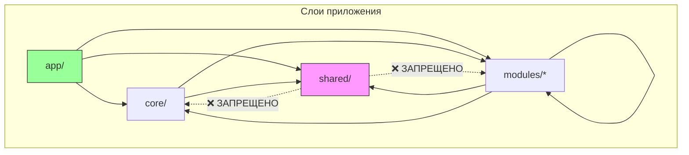

# Архитектура Frontend

> **Последнее обновление**: Январь 2026  
> **Статус**: Актуальная архитектура после рефакторинга

## Содержание

1. [Обзор](#обзор)
2. [Структура проекта](#структура-проекта)
3. [Шаблон модуля](#шаблон-модуля)
4. [Правила зависимостей](#правила-зависимостей)
5. [Domain-Driven Design](#domain-driven-design)
6. [Паттерны и практики](#паттерны-и-практики)
7. [Cross-Module интеграция](#cross-module-интеграция)
8. [Архитектурный контроль](#архитектурный-контроль)

---

## Обзор

Frontend построен на принципах **модульной архитектуры** с чётким разделением ответственности между слоями. Архитектура следует концепции **Mirror-Based Clean Architecture**, где структура фронтенда зеркалирует доменную модель бэкенда.

### Ключевые технологии

| Технология | Назначение |
|------------|------------|
| **React 18** | UI-библиотека |
| **TypeScript** | Строгая типизация |
| **TanStack Query** | Серверное состояние (кеширование, синхронизация) |
| **Zustand** | Клиентское состояние (когда необходимо) |
| **React Router 6** | Маршрутизация |
| **Material-UI** | Компонентная библиотека |
| **Vitest + RTL** | Тестирование |
| **MSW** | Мокирование API |

---

## Структура проекта

```
src/
├── app/                      # Точка входа приложения
│   ├── App.tsx               # Корневой компонент
│   ├── main.tsx              # Точка входа React
│   └── vite-env.d.ts         # Vite типы
│
├── core/                     # Ядро приложения (синглтоны)
│   ├── providers/            # React-провайдеры
│   │   ├── AuthProvider.tsx  # Контекст аутентификации
│   │   ├── I18nProvider.tsx  # Интернационализация
│   │   └── ToastProvider.tsx # Уведомления
│   │
│   ├── router/               # Маршрутизация
│   │   ├── RouterProvider.tsx
│   │   └── ProtectedRoute.tsx
│   │
│   ├── layout/               # Глобальный layout
│   │   └── Navbar/           # Навигационная панель
│   │
│   └── auth/                 # Система прав доступа
│       ├── PermissionService.ts
│       └── usePermissions.ts
│
├── shared/                   # Общий переиспользуемый код
│   ├── api/                  # Сетевой слой
│   │   └── api-client.ts     # Axios с interceptors
│   │
│   ├── ui/                   # UI-компоненты без бизнес-логики
│   │   ├── Button/
│   │   ├── TextField/
│   │   └── Dialog/
│   │
│   ├── hooks/                # Общие хуки
│   │   └── usePersistentState.ts
│   │
│   └── constants/            # Константы
│       ├── apiEndpoints.ts
│       └── routes.ts
│
├── modules/                  # Бизнес-модули (домены)
│   ├── auth/                 # Аутентификация
│   ├── users/                # Управление пользователями
│   ├── settings/             # Настройки
│   └── content/              # Контентные страницы
│
├── i18n/                     # Переводы
│   ├── en/
│   └── ru/
│
├── mocks/                    # MSW моки для тестов
│   ├── handlers.ts
│   └── server.ts
│
└── types/                    # Глобальные типы (только общие)
    └── global.d.ts
```

---

## Шаблон модуля

Каждый бизнес-модуль в `src/modules/[domain]/` **ОБЯЗАН** следовать единому шаблону:

```
src/modules/[domain]/
│
├── api/                          # Сетевой слой
│   ├── [domain].api.ts           # Методы: list, get, create, update, delete
│   └── [domain].dto.ts           # DTO: типы запросов/ответов (зеркало Pydantic)
│
├── services/                     # Бизнес-логика (опционально)
│   └── [Domain]Service.ts        # Валидация, трансформация
│
├── store/                        # Клиентский стейт (опционально)
│   └── [domain].store.ts         # Zustand
│
├── ui/                           # Презентационный слой
│   ├── pages/                    # Точки входа для роутера
│   │   └── [Domain]Page.tsx
│   │
│   ├── containers/               # Умные компоненты (данные + логика)
│   │   └── [Domain]ListContainer.tsx
│   │
│   ├── components/               # Глупые компоненты (только пропсы)
│   │   ├── [Domain]Table.tsx
│   │   └── [Domain]Form.tsx
│   │
│   └── hooks/                    # UI-хуки модуля
│       └── use[Domain].ts        # TanStack Query хуки
│
├── routes.ts                     # Маршруты модуля
├── permissions.ts                # Права доступа (опционально)
└── index.ts                      # Публичное API (реэкспорт)
```

### Правила использования

| Папка | Обязательность | Описание |
|-------|----------------|----------|
| `api/` | ✅ Обязательно | Все сетевые запросы |
| `api/*.dto.ts` | ✅ Обязательно | Типы, зеркалящие Pydantic |
| `services/` | ⚠️ По необходимости | Если есть логика помимо CRUD |
| `store/` | ⚠️ По необходимости | Если стейт нужен вне модуля |
| `ui/pages/` | ✅ Обязательно | Минимум одна страница |
| `ui/hooks/` | ✅ Обязательно | TanStack Query хуки |
| `routes.ts` | ✅ Обязательно | Для авто-регистрации |
| `index.ts` | ✅ Обязательно | Публичное API модуля |

---

## Правила зависимостей

### Диаграмма зависимостей



### Правила импорта

| Откуда | Куда | Разрешено |
|--------|------|-----------|
| `app/` | `core/`, `shared/`, `modules/` | ✅ Да |
| `core/` | `shared/`, `modules/` | ✅ Да |
| `modules/` | `shared/`, `core/`, другие `modules/` | ✅ Да |
| `shared/` | `core/` | ❌ **Нет** |
| `shared/` | `modules/` | ❌ **Нет** |

### Правило публичного API

Модули импортируют друг друга **ТОЛЬКО** через публичное API (`index.ts`):

```typescript
// ✅ Правильно — импорт через index.ts
import { TaskStatusIndicator, useRunTask } from '@modules/tasks';

// ❌ Неправильно — прямой импорт внутренностей
import { TaskStatusIndicator } from '@modules/tasks/ui/components/TaskStatusIndicator';
```

### Циклические зависимости

**Циклические зависимости между модулями ЗАПРЕЩЕНЫ.**

Если модуль A зависит от модуля B, то модуль B **НЕ МОЖЕТ** зависеть от A.

---

## Domain-Driven Design

Архитектура следует принципам **Domain-Driven Design** (DDD) Эрика Эванса и адаптирована под React-экосистему.

### Принципы

1. **Bounded Contexts (Ограниченные контексты)**
   - Каждый модуль (`modules/*`) = один bounded context
   - Модуль полностью владеет своим доменом

2. **Ubiquitous Language (Единый язык)**
   - DTO на фронтенде зеркалят Pydantic-схемы бэкенда
   - Одинаковые имена сущностей на всех слоях

3. **Layered Architecture (Слоистая архитектура)**
   ```
   UI Layer (pages, components)
       ↓
   Application Layer (hooks, containers)
       ↓
   Domain Layer (services, store)
       ↓
   Infrastructure Layer (api, api-client)
   ```

4. **Dependency Inversion**
   - Внешние зависимости (API) абстрагированы через `api-client.ts`
   - Бизнес-логика не зависит от конкретной реализации HTTP-клиента

### Связь с Clean Architecture

| Clean Architecture | Наша реализация |
|--------------------|-----------------|
| Entities | `*.dto.ts` — доменные типы |
| Use Cases | `use*.ts` хуки с TanStack Query |
| Interface Adapters | `*.api.ts` — адаптеры API |
| Frameworks | React, MUI, Axios |

---

## Паттерны и практики

### 1. Container/Presentational

```tsx
// Container — подключён к данным
function UserListContainer() {
    const { data, isLoading } = useUsers();
    return <UserTable users={data} loading={isLoading} />;
}

// Presentational — только пропсы
function UserTable({ users, loading }: UserTableProps) {
    // Чистый рендеринг без side effects
}
```

### 2. TanStack Query для серверного состояния

```tsx
// ui/hooks/useUsers.ts
export function useUsers() {
    return useQuery({
        queryKey: ['users'],
        queryFn: () => usersApi.list(),
    });
}

export function useCreateUser() {
    const queryClient = useQueryClient();
    return useMutation({
        mutationFn: usersApi.create,
        onSuccess: () => {
            queryClient.invalidateQueries({ queryKey: ['users'] });
        },
    });
}
```

### 3. Zustand для клиентского состояния

```tsx
// store/permissions.store.ts
export const usePermissionsStore = create<PermissionsState>((set) => ({
    permissions: [],
    setPermissions: (permissions) => set({ permissions }),
    hasPermission: (permission) => get().permissions.includes(permission),
}));
```

### 4. Композиция компонентов

```tsx
// Предпочитаем композицию наследованию
function UserFormDialog({ user, onClose }: Props) {
    return (
        <ConfirmDialog onClose={onClose}>
            <UserForm user={user} />
        </ConfirmDialog>
    );
}
```

---

## Cross-Module интеграция

Когда модулю нужно предоставить UI-компоненты для использования в других модулях:

### Пример: модуль `tasks` → модуль `users`

**1. Модуль `tasks` экспортирует компоненты через `index.ts`:**

```typescript
// src/modules/tasks/index.ts
export { TaskStatusIndicator } from './ui/components/TaskStatusIndicator';
export { RunTaskButton } from './ui/components/RunTaskButton';
export { useRunTask } from './ui/hooks/useRunTask';
export type { TaskType } from './api/tasks.dto';
```

**2. Модуль `users` импортирует через публичное API:**

```tsx
// src/modules/users/ui/pages/UserTabPage.tsx
import { RunTaskButton } from '@modules/tasks';
import { Can } from '@core/auth';

function UserTabPage() {
    return (
        <Box>
            <Can permission="tasks:run">
                <RunTaskButton 
                    taskType="ldap_sync"
                    label="Синхронизировать LDAP"
                />
            </Can>
        </Box>
    );
}
```

**3. Интеграция в `core/layout/Navbar`:**

```tsx
// src/core/layout/Navbar/Navbar.tsx
import { TaskStatusIndicator } from '@modules/tasks';
import { Can } from '@core/auth';

function Navbar() {
    return (
        <AppBar>
            <Can permission="tasks:view">
                <TaskStatusIndicator />
            </Can>
        </AppBar>
    );
}
```

---

## Архитектурный контроль

### ESLint Plugin: Boundaries

Правила зависимостей автоматически проверяются через `eslint-plugin-boundaries`.

**Конфигурация в `eslint.config.js`:**

```javascript
settings: {
    'boundaries/elements': [
        { type: 'app', pattern: 'src/app/*' },
        { type: 'core', pattern: 'src/core/*' },
        { type: 'shared', pattern: 'src/shared/*' },
        { type: 'module', pattern: 'src/modules/*' },
    ],
},
rules: {
    'boundaries/element-types': ['error', {
        default: 'disallow',
        rules: [
            { from: 'shared', allow: ['shared'] },  // shared изолирован
            { from: 'module', allow: ['shared', 'core', 'module'] },
            // ...
        ],
    }],
}
```

### Архитектурные тесты

Дополнительная проверка через `src/__tests__/architecture.test.ts`:

```typescript
it('shared/ should not import from modules/', () => {
    // Сканирует файлы shared/ на наличие @modules/ импортов
});
```

### Команды проверки

```bash
# Проверка архитектурных правил
npm run lint

# Запуск архитектурных тестов
npm run test -- src/__tests__/architecture.test.ts
```

---

## Быстрый старт для разработчика

1. **Понять структуру** — 5 минут на эту документацию
2. **Выбрать модуль** — найти `src/modules/[domain]/`
3. **Следовать шаблону** — использовать существующий модуль как образец
4. **Проверить правила** — `npm run lint` перед коммитом

> **Критерий успеха**: Новый разработчик понимает архитектуру за 15 минут.
