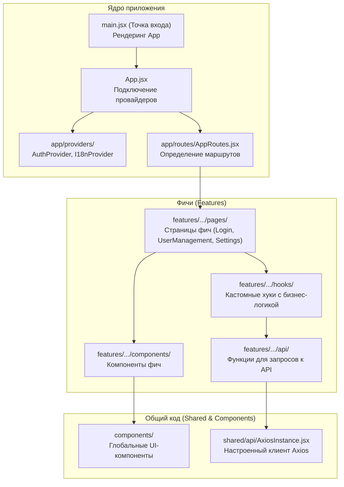

# Обзор Фронтенда

Фронтенд проекта Infraportal — это одностраничное приложение (SPA), разработанное на React. Оно предоставляет пользовательский интерфейс для взаимодействия с бэкендом, включая аутентификацию, управление пользователями, группами, ролями и системными настройками.

## Ключевые Технологии

*   **React**: Библиотека для создания пользовательских интерфейсов.
*   **Vite**: Современный и быстрый сборщик проектов, используемый для разработки и сборки приложения.
*   **Material-UI (MUI)**: Библиотека готовых React-компонентов, реализующая гайдлайны Google Material Design.
*   **React Router**: Библиотека для реализации маршрутизации в приложении.
*   **Axios**: HTTP-клиент для выполнения запросов к бэкенд API.
*   **React Hook Form**: Библиотека для управления состоянием форм, их валидации и отправки.
*   **i18next**: Фреймворк для интернационализации (i18n) приложения.
*   **Vitest**: Фреймворк для тестирования, совместимый с Vite.
*   **MSW (Mock Service Worker)**: Библиотека для мокирования API-запросов во время тестирования и разработки.

## Структура Проекта

Основная структура проекта находится в директории `frontend/src/`.

*   `app/`: Ядро приложения: главный компонент `App.jsx`, провайдеры (аутентификация, i18n) и основная маршрутизация.
*   `components/`: Глобальные, переиспользуемые UI-компоненты, не привязанные к конкретной бизнес-логике (например, `IpAlert`, `Navbar`).
*   `features/`: Ключевая директория, содержащая модули бизнес-логики ("фичи"), такие как `auth`, `userManagement` и `settings`. Каждая фича имеет собственную структуру (api, components, hooks, pages).
*   `shared/`: Общий код, используемый в нескольких фичах. Сюда входят инстанс Axios, константы (маршруты, ключи), и общие хуки.
*   `i18n/`: Конфигурация и файлы переводов для интернационализации.
*   `mocks/`: Настройка MSW для мокирования API в тестах.

## Настройка окружения для разработки

### 1. Установка зависимостей

Перейдите в директорию `frontend/` и выполните команду:
```bash
npm install
```

### 2. Запуск dev-сервера

Для запуска локального сервера для разработки выполните:
```bash
npm run dev
```
Приложение будет доступно по адресу `http://localhost:5173` (порт может отличаться).

## Архитектурная схема



## Разделы Документации Фронтенда

Ниже представлены ссылки на детальную документацию по различным аспектам фронтенда:

*   [Взаимодействие с API](api_interaction.md)
*   [Компоненты и Макет](components_and_layout.md)
*   [Управление состоянием](state_management.md)
*   [Маршрутизация](routing.md)
*   [Интернационализация (i18n)](internationalization.md)
*   [Тестирование](testing.md)
*   [Управление Настройками](settings.md)
